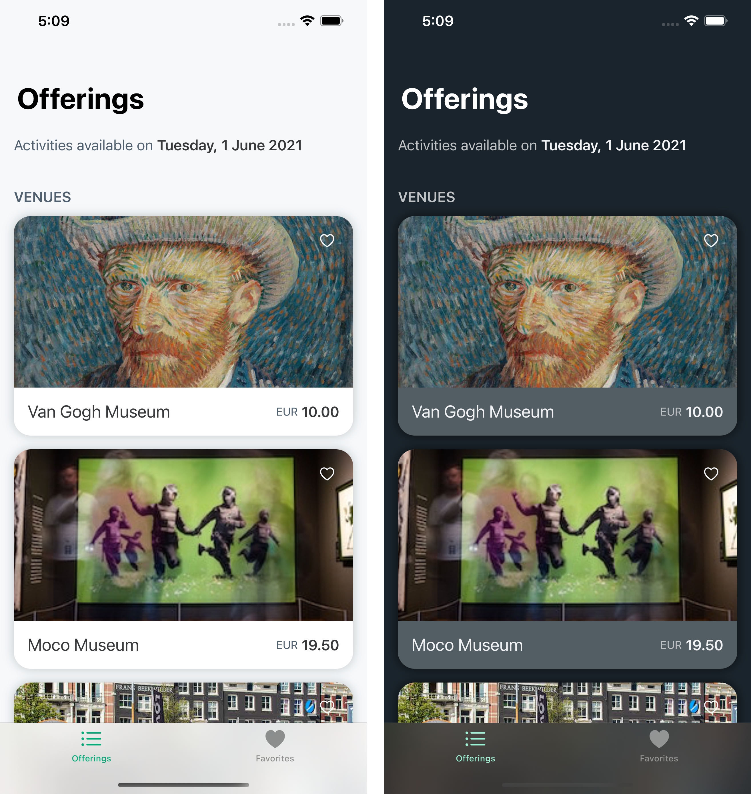
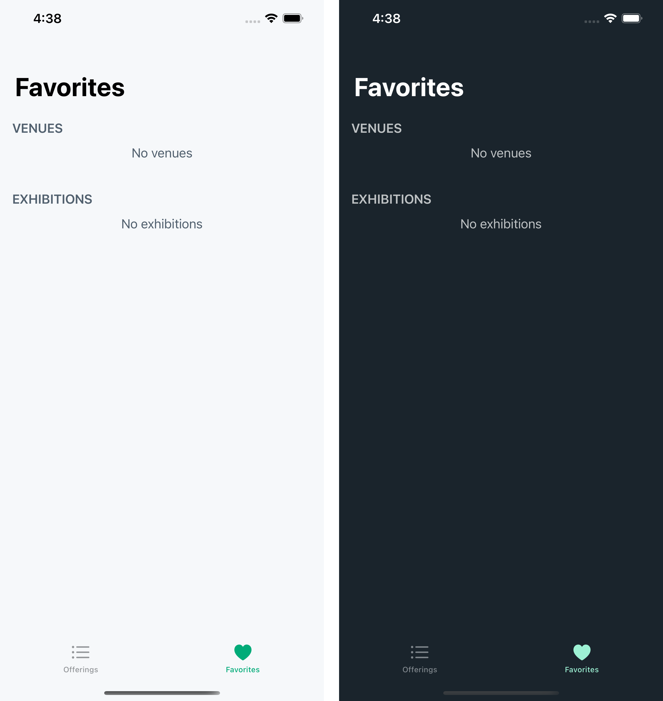
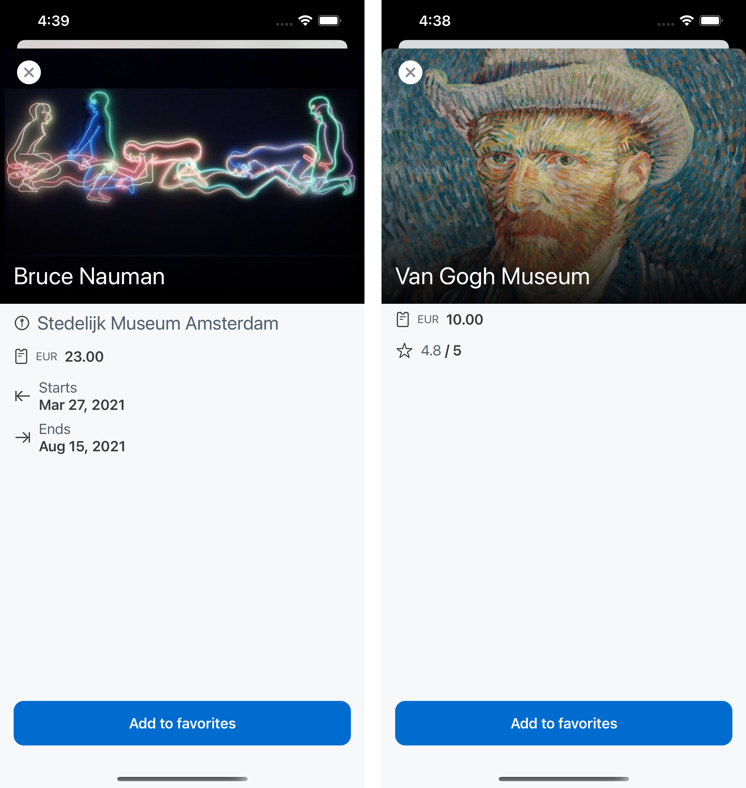

# tiqets-assignment

This is my implementation of the assignment for the Sr. iOS Engineer position at Tiqets.

The app is built using `Swift`, `SwiftUI` & `Combine`.

## Architecture

The app is built using an MVVM architecture, where Models & other controllers (business logic) are nested in separate targets (Core & Networking).
This enforces separation of duties & helps mitigate code-spaghettification, but also allows for reuse in other projects.

### Core

Contains most `UseCases` and their implementations, as well as mocks for testing & debugging.
Conform to the assignment, I've included a use case for providing the current `Date`, which is hard-coded to the 1st of June 2021 in Mock implementations (used as default for demonstration purposes).

### Networking

Contains the config files for API requests as well as mocks for testing & debugging, and is built on top of my own, open-source, networking package [Netswift](https://github.com/MrSkwiggs/Netswift).
It's an opinionated framework I've built myself over the last couple of years and have used in my own apps as well as at [OneFit](https://one.fit), which allows me to be very structured but flexible when it comes to implemented an app's networking layer.

## UI

The app has a top-level Tab View for `Offerings` & `Favorites`. It also supports Light & Dark themes.

### Offerings

The app opens on the Offerings tab by default.

### Favorites

At first, there are no favorites, but the user can easily add & remove them.

### Details

Tapping an exhibition/venue opens a modal details page where more information can be seen at a glance.

### Adding / Removing Favorites

Can either be done directly from the listing by tapping the heart-icon or the dedicated button in the details page.

This will cause the Favorites tab to update accordingly.

### Error Handling & Asynchronous updates

The app is built to handle errors & asynchronous data flows.

You can try this for yourself by un-commenting the specific Composition roots I have left in the [SceneDelegate](Tiqets/Tiqets/SceneDelegate.swift).

